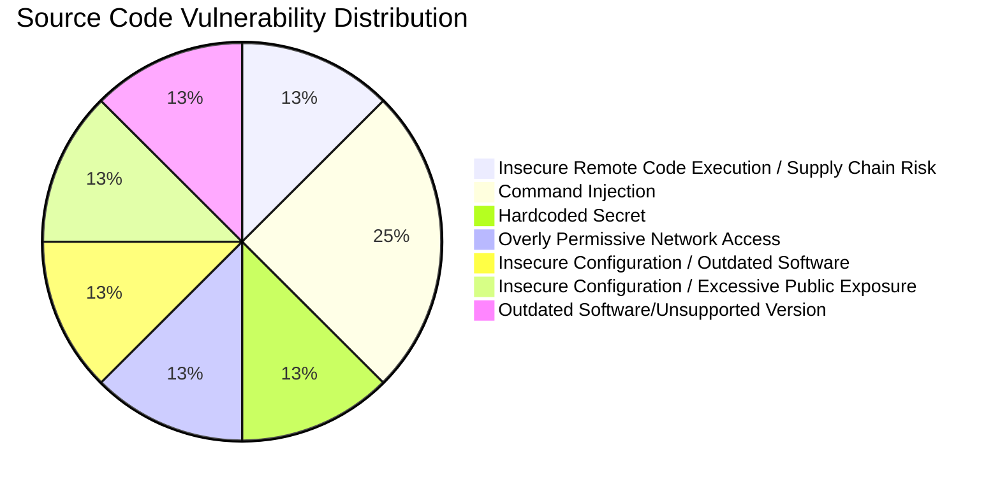

# 🛡️ Security Scan Report

**Repository:** `https://sample.com/DevOps_Internal/DevopsInternal_Project.git`
**Scan Date:** October 15, 2025

---
## 📊 Executive Summary

The scan identified a total of **8 vulnerabilities.**

### Vulnerability Overview

| Severity | Vulnerability Type | File Location |
| :--- | :--- | :--- |
| 🟡 Medium | Insecure Remote Code Execution / Supply Chain Risk | `modules/deploy-monitoring.sh` |
| 🟡 Medium | Overly Permissive Network Access | `modules/securitygroup.tf` |
| 🟡 Medium | Insecure Configuration / Outdated Software | `modules/eks.tf` |
| 🟡 Medium | Insecure Configuration / Excessive Public Exposure | `modules/eks.tf` |
| 🟡 Medium | Outdated Software/Unsupported Version | `modules/nodegroup.tf` |
| 🟠 High | Hardcoded Secret | `modules/deploy-monitoring.sh` |
| 🔴 Critical | Command Injection | `modules/deploy-monitoring.sh` |
| 🔴 Critical | Command Injection | `modules/deploy-monitoring.sh` |

### Vulnerability Distribution Chart

---

## 📦 Dependency Vulnerabilities (from OSV-Scanner)

✅ **Status:** No dependency vulnerabilities were found.

---

## 📝 Source Code Vulnerabilities (from AI Scan)

Below is a detailed breakdown of each vulnerability found in the source code.

### 📄 File: `modules/deploy-monitoring.sh`

#### **Vulnerability: Insecure Remote Code Execution / Supply Chain Risk**
- **Severity:** 🟡 Medium
- **Line:** 9

**🚨 Risk:**
This command downloads a script from a remote URL (`https://raw.githubusercontent.com/helm/helm/main/scripts/get-helm-3`) and pipes it directly to `bash` for execution without any integrity verification (e.g., checksum or GPG signature). If the remote repository or the specific script is compromised, malicious code could be executed on the system with the permissions of the user running this script, leading to a supply chain attack.

**✅ Recommendation:**
Avoid piping remote scripts directly to an interpreter. Instead, download the script, verify its integrity (e.g., using a known good checksum or GPG signature if available), and then execute it. For production environments, consider using pre-built images with Helm installed or installing Helm via a trusted package manager (if available for your OS/distribution).
 

#### **Vulnerability: Command Injection**
- **Severity:** 🔴 Critical
- **Line:** 13

**🚨 Risk:**
The variable `$CLUSTER_NAME` is used directly in the `aws eks update-kubeconfig` command without being enclosed in double quotes. If `CLUSTER_NAME` were to contain special characters or command separators (e.g., `mycluster; rm -rf /`), an attacker could potentially inject and execute arbitrary commands. While `CLUSTER_NAME` appears to be an internal variable placeholder (`var.eks_name`), it's a critical security best practice to always quote variables used in shell commands to prevent word splitting and globbing, which can lead to command injection if the variable's content is ever derived from an untrusted source.

**✅ Recommendation:**
Always enclose variables in double quotes when used in shell commands to prevent word splitting and globbing: `aws eks update-kubeconfig --name "$CLUSTER_NAME" --region "$REGION"`.
 

#### **Vulnerability: Command Injection**
- **Severity:** 🔴 Critical
- **Line:** 16

**🚨 Risk:**
The variable `$NAMESPACE` is used directly in the `kubectl create namespace` command without being enclosed in double quotes. Although `NAMESPACE` is hardcoded in this script, using unquoted variables is a common source of command injection. If the source of `NAMESPACE` were to change to an untrusted input in the future, an attacker could inject malicious commands. This bad practice should be corrected even for hardcoded values to maintain secure coding standards.

**✅ Recommendation:**
Always enclose variables in double quotes when used in shell commands: `kubectl create namespace "$NAMESPACE"`. This fix also applies to lines 24 (`helm install prometheus prometheus-community/prometheus --namespace "$NAMESPACE"`) and 30 (`kubectl get svc -n "$NAMESPACE"`).
 

#### **Vulnerability: Hardcoded Secret**
- **Severity:** 🟠 High
- **Line:** 27

**🚨 Risk:**
The Grafana administrator password is hardcoded as `'admin'` directly in the `helm install` command. This is a severe security vulnerability as it provides a default, easily guessable password for a critical monitoring tool. Anyone with network access to the Grafana instance (especially since `service.type=NodePort` exposes it) could gain administrative access, potentially viewing sensitive operational data or even manipulating the monitoring setup.

**✅ Recommendation:**
Do not hardcode sensitive information like passwords. Instead, use a secure secret management solution. For Kubernetes deployments, this typically involves: 1) Generating a strong, unique password. 2) Storing it securely (e.g., in AWS Secrets Manager, HashiCorp Vault). 3) Creating a Kubernetes Secret from the securely stored password. 4) Referencing this Kubernetes Secret in the Helm chart values (e.g., `--set adminPasswordFromSecret=grafana-admin-secret`). Alternatively, if a secret manager is not used, pass the password via an environment variable that is securely managed by the CI/CD system, or prompt the user for it.
 

### 📄 File: `modules/securitygroup.tf`

#### **Vulnerability: Overly Permissive Network Access**
- **Severity:** 🟡 Medium
- **Line:** 17

**🚨 Risk:**
The security group rule allows inbound SSH (port 22) traffic from '0.0.0.0/0', meaning it is accessible from any IP address on the internet. This significantly increases the attack surface for any resources associated with this security group, making them vulnerable to brute-force attacks, unauthorized access, and other network-based threats.

**✅ Recommendation:**
Restrict the `cidr_blocks` for SSH access to only known, trusted IP addresses or ranges (e.g., your office IP, a VPN IP, or a bastion host's IP). Avoid exposing SSH to the entire internet. If remote access is required, consider using AWS Systems Manager Session Manager, a VPN, or a dedicated bastion host with tightly controlled access.
 

### 📄 File: `modules/eks.tf`

#### **Vulnerability: Insecure Configuration / Outdated Software**
- **Severity:** 🟡 Medium
- **Line:** 30

**🚨 Risk:**
The EKS cluster is configured to use Kubernetes version 1.17. This version is End-of-Life (EOL) and no longer receives security patches, bug fixes, or support from AWS. Running an EOL Kubernetes version leaves the cluster vulnerable to known and undiscovered security exploits, potentially leading to compromise, data breaches, or service disruption.

**✅ Recommendation:**
Update the EKS cluster to a currently supported and recommended Kubernetes version (e.g., 1.28 or newer). It is also a best practice to use a variable for the version to allow for easier updates and management. Example: `version = var.eks_version` where `var.eks_version` is defined with a current, supported version.
 

#### **Vulnerability: Insecure Configuration / Excessive Public Exposure**
- **Severity:** 🟡 Medium
- **Line:** 34

**🚨 Risk:**
The EKS cluster's API endpoint is configured for public access (`endpoint_public_access = true`) without any specified CIDR restrictions, and private access is disabled (`endpoint_private_access = false`). This exposes the EKS API endpoint directly to the entire public internet. While AWS IAM authentication is required, this configuration significantly increases the attack surface for brute-force attacks, denial-of-service attempts, or exploitation of any future authentication vulnerabilities. For most production workloads, it is recommended to restrict API access to private networks or specific trusted IP CIDR blocks.

**✅ Recommendation:**
For enhanced security, configure the EKS endpoint to be private (`endpoint_private_access = true`, `endpoint_public_access = false`) if all management is done from within the VPC or via VPN/Direct Connect. If public access is absolutely required, restrict it to specific trusted IP CIDR blocks using the `public_access_cidrs` attribute. Example for restricted public access: `public_access_cidrs = ["203.0.113.0/24", "198.51.100.0/24"]` (replace with your actual trusted IP ranges).
 

### 📄 File: `modules/nodegroup.tf`

#### **Vulnerability: Outdated Software/Unsupported Version**
- **Severity:** 🟡 Medium
- **Line:** 70

**🚨 Risk:**
The EKS node group is configured to use Kubernetes version '1.17'. Kubernetes 1.17 is an old version that is no longer supported by the Kubernetes community or AWS EKS. Running an unsupported version means it will not receive security patches for newly discovered vulnerabilities. This significantly increases the attack surface and exposes the cluster to known and unpatched security flaws, potentially leading to unauthorized access, privilege escalation, or denial of service.

**✅ Recommendation:**
Update the Kubernetes version to a currently supported and patched version. Always refer to the official AWS EKS documentation for the latest supported versions. For example, change `version = "1.17"` to `version = "1.28"` (or the latest stable version at the time of deployment) to ensure the node group benefits from ongoing security updates and bug fixes.
 